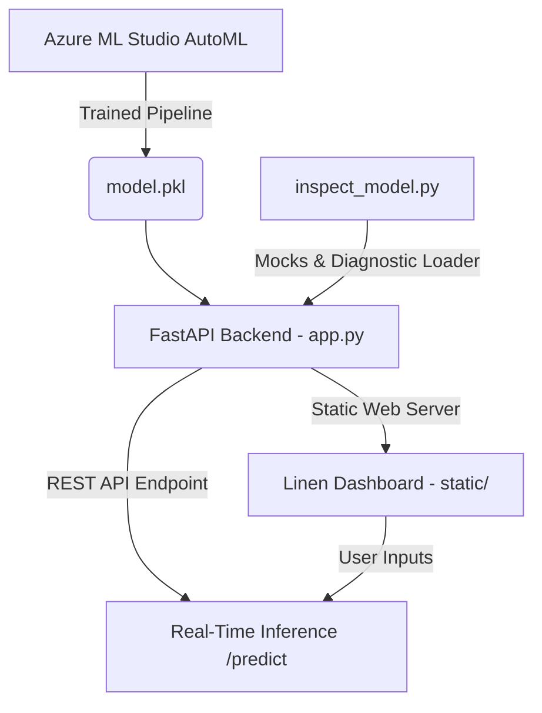

# ChurnSight AI

An end-to-end customer churn prediction platform featuring a machine learning pipeline powered by **Azure Machine Learning AutoML** and a high-performance **FastAPI** inference backend. The application serves an ultra-minimalist, real-time prediction dashboard styled using the custom **Linen Editorial Design System**.

---

## 🏗️ System Architecture



### 1. Model & Diagnostics
* **AutoML Engine**: The core model (`model.pkl`) is a gradient-boosted classifier trained via Azure AutoML to analyze customer demographics, account characteristics, and service configurations.
* **Mock Loader (`inspect_model.py`)**: To prevent bloating production docker containers or cloud webapps with the massive Azure Machine Learning SDK, `inspect_model.py` runs diagnostics on the serialized model, intercepting dynamic class lookups and substituting mock stubs for runtime scoring. This ensures high-speed, lightweight container startup.

### 2. REST API Backend (`app.py`)
* Implemented in **FastAPI** with Pydantic validation schemas.
* Exposes `/predict` (single-record real-time inference) and `/health` (liveness checks for Azure App Service).
* Automatically parses categorical mappings, calculates risk thresholds, and returns prediction probabilities.

### 3. Frontend Dashboard (`static/`)
* Built using the **Linen Design System**—an editorial print-like aesthetic utilizing a warm cream surface (`#f1ede3`), hairline rules (`1px solid`), high-contrast typography, and a single crimson Signal accent (`#c8462c`).
* Uses **Lucide** for line icons.
* Allows customer agents to dynamically adjust parameters (contract length, payment methods, charges) and instantly see churn risk levels.

---

## 📁 Repository Structure

* [app.py](file:///c:/Drive%20D/Azure%20ML/workspace/app.py) — FastAPI web service and prediction API router.
* [inspect_model.py](file:///c:/Drive%20D/Azure%20ML/workspace/inspect_model.py) — Intercepts and logs Azure AutoML pickle class dependencies.
* [model.pkl](file:///c:/Drive%20D/Azure%20ML/workspace/model.pkl) — The trained AutoML prediction model.
* [Churn.ipynb](file:///c:/Drive%20D/Azure%20ML/workspace/Churn.ipynb) — Jupyter notebook covering clean data generation, model training, and endpoint testing.
* [churn.csv](file:///c:/Drive%20D/Azure%20ML/workspace/churn.csv) — Sample dataset used for local training.
* [conda_env_v_1_0_0.yml](file:///c:/Drive%20D/Azure%20ML/workspace/conda_env_v_1_0_0.yml) — AutoML training environment details.
* [requirements.txt](file:///c:/Drive%20D/Azure%20ML/workspace/requirements.txt) — Production runtime dependencies.
* [startup.txt](file:///c:/Drive%20D/Azure%20ML/workspace/startup.txt) — Linux deployment script for Gunicorn.
* [DESIGN.md](file:///c:/Drive%20D/Azure%20ML/workspace/DESIGN.md) — Specifications for the Linen Design System.
* [architecture.md](file:///c:/Drive%20D/Azure%20ML/workspace/architecture.md) — Architectural justifications and blueprinted systems.
* [src/scoring_file_v_2_0_0.py](file:///c:/Drive%20D/Azure%20ML/workspace/src/scoring_file_v_2_0_0.py) — Standard inference script generated by Azure ML Studio.
* [static/](file:///c:/Drive%20D/Azure%20ML/workspace/static) — Clean UI assets including CSS rules and frontend logic.

---

## 🚀 Getting Started

### 1. Prerequisites
Ensure you have Python 3.10+ installed.

### 2. Environment Setup
Clone the repository and install the production dependencies:
```bash
pip install -r requirements.txt
```

### 3. Running Locally
Start the FastAPI server locally using Uvicorn:
```bash
uvicorn app:app --reload --host 127.0.0.1 --port 8000
```
Open your browser and navigate to:
* **Dashboard**: `http://127.0.0.1:8000/`
* **API Documentation (Swagger)**: `http://127.0.0.1:8000/docs`

---

## ☁️ Cloud Deployment

### Azure App Service (Web App for Containers)
This project is pre-configured to deploy seamlessly on Azure App Service:
1. **Startup Command**: The platform uses `startup.txt` to spin up a production-ready Gunicorn cluster:
   ```bash
   gunicorn -w 2 -k uvicorn.workers.UvicornWorker --bind=0.0.0.0:8000 --timeout 120 app:app
   ```
2. **Health Probe**: Set the application's physical startup probe or health check path to `/health`.

---

## 🎨 Linen Design System
The frontend implements a strict print-brand layout:
* **Color Palette**: Warm Linen cream (`#f1ede3`), Paper neutral (`#f7f4ec`), and Signal orange-red (`#c8462c`).
* **Typography**: *Archivo Narrow* for architectural headers and numerals; *Inter* for form elements and UI text; *JetBrains Mono* for telemetry and metrics.
* **Elevation**: Completely flat layout (no shadows, zero-radius borders, 1px separation lines).
